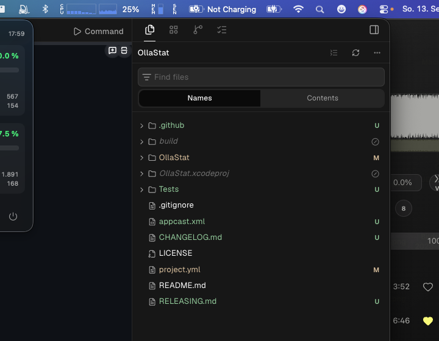

# OllaStat

🦙 Eine native **macOS-Menüleisten-App** (SwiftUI, `MenuBarExtra`), die die Token-/Request-Nutzung deines **Ollama Cloud**-Accounts live in der Menüleiste anzeigt.



## Features

- **Menüleiste** mit Llama-Template-Icon + Live-Werten, z. B. `42%` (5h-Fenster) und optional `42% · 12%` (5h + Woche); passt sich Hell-/Dunkelmodus an
- **Dropdown-Panel**:
  - 5-Stunden-Fenster und Wochennutzung mit Fortschrittsbalken (grün/orange/rot je nach Auslastung)
  - „Resets in …“-Countdown pro Fenster
  - Requests pro Modell (wie auf ollama.com/settings)
- **Automatisches Polling** (1–60 Minuten, Standard 5) + manueller Refresh-Button
- **Schwellen-Benachrichtigungen** (macOS-Mitteilungen) bei z. B. 50/75/90/100 %
- **Auto-Updates** via Sparkle (automatische Prüfung + „Nach Updates suchen …“ in den Einstellungen)
- **Cookie-Verwaltung** über den macOS-Schlüsselbund mit eingebauter Anleitung und Validierung
- **Start bei Anmeldung** (SMAppService), Snapshot-Cache für Sofortanzeige nach Relaunch

## Warum kein „richtiges“ API-Token?

Ollama bietet aktuell **keine offizielle API** für Account-Nutzungswerte (siehe [ollama/ollama#15132](https://github.com/ollama/ollama/issues/15132) und [#12532](https://github.com/ollama/ollama/issues/12532)). Die Werte werden serverseitig auf der angemeldeten Seite [ollama.com/settings](https://ollama.com/settings) gerendert. OllaStat ruft diese Seite mit deinem **Session-Cookie `__Secure-session`** ab und parst die Maschinen-Marker (`data-usage-track`, `data-usage-segment`, `data-time`).

> ⚠️ **Disclaimer:** Inoffizielles Werkzeug, nicht mit Ollama verbunden. Der Abruf kann brechen, wenn Ollama die Settings-Seite ändert. Der Cookie ermöglicht vollen Zugriff auf deine Sitzung — OllaStat speichert ihn ausschließlich lokal im Schlüsselbund und sendet ihn **nur** an ollama.com.

## Lizenz

OllaStat steht unter der **[PolyForm Noncommercial License 1.0.0](https://polyformproject.org/licenses/noncommercial/1.0.0)**.

> Required Notice: Copyright (c) 2026 Michael Vogeler (https://github.com/diceone)

- ✅ **Erlaubt:** Kopieren, Modifizieren, Weitergeben und Nutzung für persönliche/nicht-kommerzielle Zwecke (Hobby, Studium, Forschung, gemeinnützige Organisationen …)
- ❌ **Verboten:** Kommerzielle Nutzung — mit der Software darf niemand Geld verdienen (Verkauf, SaaS, bezahlte Distribution, Nutzung im kommerziellen Arbeitsumfeld)
- Kommerzielle Rechte bleiben beim Autor. Anfragen für kommerzielle Lizenzen bitte über [GitHub Issues](https://github.com/diceone/OllaStat/issues)

## Setup

**Fertige Builds gibt es in den [GitHub Releases](https://github.com/diceone/OllaStat/releases) (DMG) oder per Homebrew:**

```bash
brew install --cask diceone/tap/ollastat
```

Die App ist nicht notarisiert — beim ersten Start ggf. Rechtsklick → *Öffnen* oder `xattr -dr com.apple.quarantine /Applications/OllaStat.app`.

1. **In-App-Anmeldung:** OllaStat → Menüleiste → **Einstellungen** → **„Bei ollama.com anmelden …"** → im eingebetteten Browserfenster anmelden (z. B. mit GitHub). OllaStat fängt das Session-Cookie automatisch ab, prüft es und speichert es im Schlüsselbund — nichts kopieren.

Der Cookie läuft nach ca. 3 Monaten ab — dann erscheint ein `!` neben dem Llama in der Menüleiste und ein Klick auf „Einstellungen“ bringt dich direkt zur erneuten Anmeldung.

## Releases & Updates

OllaStat aktualisiert sich selbst über [Sparkle](https://sparkle-project.org) (AppCast: [`appcast.xml`](appcast.xml)). CI baut bei jedem Tag-Push automatisch DMG + Release — Details in [RELEASING.md](RELEASING.md), Versionshistorie im [Changelog](CHANGELOG.md).

## Build

Voraussetzungen: Xcode 15+, [xcodegen](https://github.com/yonaskolb/XcodeGen) (`brew install xcodegen`).

```bash
xcodegen generate
xcodebuild -project OllaStat.xcodeproj -scheme OllaStat -configuration Debug build
open build/Debug/OllaStat.app            # bzw. DerivedData-Pfad
```

Tests:

```bash
xcodebuild -project OllaStat.xcodeproj -scheme OllaStat test
```

In Xcode: `OllaStat.xcodeproj` öffnen und das Schema `OllaStat` starten.

## Projektstruktur

```
OllaStat/
├── App/OllaStatApp.swift      # @main, MenuBarExtra, Sparkle-Updater, Settings-Fenster
├── Views/PanelView.swift      # Dropdown mit Fenstern/Modellen
├── Views/LoginView.swift      # Eingebetteter WKWebView-Login (Cookie-Automatik)
├── Views/SettingsView.swift   # Anmeldung, Intervall, Schwellen, Updates
├── Core/HTMLParser.swift      # Mini-HTML-DOM (selbstständig, keine Dependencies)
├── Core/UsageParser.swift     # Settings-Markup → UsageData
├── Core/UsageFetcher.swift    # Abruf mit Cookie + Session-Expired-Erkennung
├── Core/UsageMonitor.swift    # Polling, Schwellen-Tracker, Menü-Label
├── Core/KeychainStore.swift   # Cookie im Schlüsselbund
├── Core/AppSettings.swift     # UserDefaults + Snapshot-Persistenz
├── Resources/Assets.xcassets  # Menüleisten-Template-Icon
├── appcast.xml                # Sparkle-AppCast (von CI aktualisiert)
└── .github/workflows/         # ci.yml (Tests), release.yml (DMG + Release)
```

Die Parser-Tests laufen gegen ein Fixture der echten ollama.com/settings-Struktur (`Tests/Fixtures/settings.html`), die Fetcher-Tests gegen einen Mock-URLProtocol (`Tests/UnitTests/UsageFetcherTests.swift`).